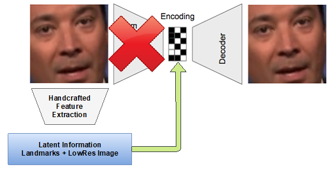

# General
If you use PyCharm for developing, mark the `implementation` folder as root.

# Preprocessing
Before you are able to train models, you have to preprocess your data. Therefore, you have to store all the images of
your dataset in a subfolder called `raw`. Preprocessing preserves the directory structure of your `raw` directory. However, for most models you want to store all images at the root level:

```
dataset/
`-- raw
    |-- image1.jpg
    |-- image2.jpg
    .
    .
    .
    `-- image9999.jpg
```

In the next step you have to define the path to your dataset. This can be done in `Configuration/config_general`:

```python
DATASET = "/path_to/dataset"
ROOT = Path(DATASET)
```

Now you need to run the script `preprocess.py` and wait until your data is processed:
```python
(face) max@MaxLaptop:~$ python preprocess.py 
 |████████████████████████████████████████████████████████████████████████████████████████████████████| 100.0%                                                                                                                                                          
All images processed. Storing results in NumPy arrays...                                                                                                                                                                                                                
Preprocessing finished! You can now start to train your models!  
```

After the preprocessing your dataset folder should contain several subfolders with images in different resolutions and
a lot of NumPy arrays with extracted features.

# Architecture
### FaceExtractor & FaceReconstructor


We use the depicted pipeline during preprocessing and training to produce images, that are as easy as possible to
be modeled using our neural nets. The second part of that pipeline fits generated images back into the original scene.
This module is built using classical computer vision methods. For the extraction of facial landmarks we used the great
face recognition package from [Adam Geitgey](https://github.com/ageitgey/face_recognition). We use those landmarks to determine the
position of faces in images, but also as input features for our networks.

## Models

### DeepFakes
DeepFakes uses deep convolutional auto encoders to swap the face of two people, preserving the facial expression. It is publicly available via GitHub and caught our attention through an excellent article on hackernoon.com (https://hackernoon.com/exploring-deepfakes-20c9947c22d9). The architecture can be depicted as follows:


*https://hackernoon.com/exploring-deepfakes-20c9947c22d9*

### LatentModel
The idea behind our "Latent Model" is to use already extracted features as input for a simple decoder network. The network is trained end to end with an image as target and features extracted from it as input. If the features have a higher dimensionality we reduced it by flattening it. Several features were just concatenated to one input vector. As features we experimented with several representations of landmarks (i.e. combine all landmarks of the nose to one), low resolution image, histogram and a deep face encoding.



*https://hackernoon.com/exploring-deepfakes-20c9947c22d9*

For the decoder we just reused the decoder from the Deepfakes architecture. We achieved best results by combining all landmarks and a 8x8x3 (RGB) representation of the input image to a feature vector. The loss is just defined by the L1 distance of the input image and the generated one.

### LatentGAN
The "LatentGAN" is an architecture which combines our latent model with a discriminator, forming an architecture similar to a generative adversarial network. The motivation behind this architecture was the fact that our latent model already produced quite decent results. However, we wanted to make them look even more realistic and came up with the idea of integrating a discriminator into the model.


*https://hackernoon.com/exploring-deepfakes-20c9947c22d9*

### Conditional GAN
Deep convolutional GANs were proposed in 'Unsupervised Representation Learning with Deep Convolutional Generative Adversarial Networks' from Radford et. al (https://arxiv.org/pdf/1511.06434.pdf). They combine the classic GAN approach with deep convolutional neural networks. By the means of CNNs as high capable function approximators, the performance of GANs should be increased. In this model, we have also introduced condition on facial key points to preserve the facial expression of an input image. However, this conditioning can be unstable to some extend due to the high dimensionality of our conditioning vector.


https://www.abtosoftware.com/blog/image-to-image-translation

### Conditional Progressive GAN
Progressive GANs are more a new method of training GANs, than a new architecture. This state-of-the-art training method was introduced by Karras et. al (https://arxiv.org/pdf/1710.10196.pdf). During training, layers are added sequentially to incrementally refine the quality of our output images. We can also condition our model on facial landmarks and color features, thus enabling us to create high quality output images which preserve facial expression.
